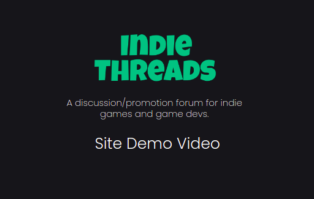

<p align="center">
    
</p>

<p align="center">
A free platform for gamers to explore the indie gaming community, discussion, promotion by/for developers and players.
</p>


<p align="center">
  
  
    
  
  
  
</p>

<p align="center">
  <a style="padding: 0 10px;" href="https://indie-threads.netlify.app/">Live Demo</a> • 
  <a style="padding: 0 10px;" href="#contributing">Contributing</a> • 
  <a style="padding: 0 10px;" href="#features">Features</a>
</p>


<h2 align="center" style="font-weight:bold">Project Description</h2>

A free platform for gamers to explore the **indie gaming community**, discussion, promotion by/for developers and players. To spread word of mouth thereby reducing strain on the high budget of advertising. And we'll not be collecting any personal data of user/visitor. Big gaming companies uses their major funds in advertising by paying off the streamers to spread the word of mouth among their viewers and others, this platform would provide them with the same **help without the high budget requirement.**

<h2 align="center" style="font-weight:bold" id="features">Platform Features</h2>

- **Create community for your games:** Create a profile for your game, with discussion forums, ratings, platforms available on, genre, system requirement and lots more.

- **Safe environment for dicussions:** We have implemented **profane language filters** to clean up bad language in the discussion forums.

- **Open for all:** Even if a person doesn't create a profile, they can **access the forums' content without the obligation of creating a profile**, he/she will have to create a profile only if they want to add to the content.

- **Promote your games:** We provide you the feature to **promote your game and its community** in various social media platforms **with just one click.**

<h2 align="center" style="font-weight:bold">Core Values</h2>

1. Serve the community of **"small" known and unknown gaming communities** around the internet.
2. Help independent game developers to **create a community for their games.**

<h2 align="center" style="font-weight:bold" id="contributing">Contributing</h2>

**Indie Threads** is an open source project, and any contributions to the project is highly appreciated and encouraged. Feel free to open issues to report bugs or request new features and label them accordingly.

* Make sure to run `npm run format` to format all the files based on the ESLint configuration.
* Run `npm run lint:fix` to enforce the linting rules before any PR.

**Fireabase setup:** create a firebase project and copy the credentials to `.env.local` file in the root folder. A sample `.env.local` file is provided as `.env.example`.

<h3 style="font-weight:bold">Setup Development environment</h3>

```bash
# clone the repository to the local directory
git clone https://github.com/anjali-001/indie-threads.git

# install the dependencies
npm install

# start the react app
npm start
```

<h2 align="center" style="font-weight:bold" id="contributing">Project Demo</h2>

<p align="center" style="margin: 20px 0 30px 0">

  <a href="http://www.youtube.com/watch?v=hEmpHsZgTJo">
    
  </a>
</p>  

<p align="center" style="margin: 0 70px 30px 0">
The following is the video demostration of the platform features at the time of submission to the Explorer sprint 
</p>

<h2 align="center" style="font-weight:bold" id="contributing">Core Team & Inspiration</h2>

This project was initially developed by the following members for the [MLH Explorer Sprint 1](https://devpost.com/software/indie-threads?ref_content=user-portfolio&ref_feature=in_progress). The theme for the spirint was **gaming**. So, we thought of creating a free platform for indie game devs to promote and advertise their games without having to worry about a high budget requirement for promotions whilst providing a channel to the gamers to explore the indie-gaming community which would serve as discussion forums at the same time, indie-threads took its shape.

- [Anjali](https://github.com/anjali-001)
- [Keshavaa Shaiskandan](https://github.com/skeshavaa)
- [Siddesh Sambasivam Suseela](https://github.com/SiddeshSambasivam)

**Authored By:** Siddesh

<h2 align="left" style="font-weight:bold" id="contributing">License</h2>

Indie Threads is open source and available under the [MIT License](LICENSE).
